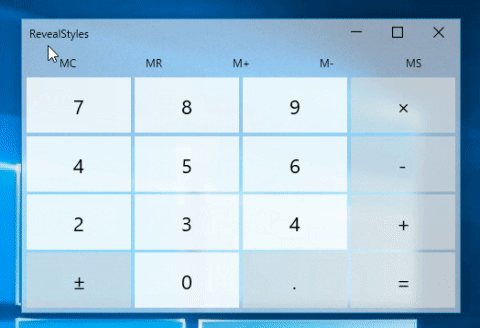
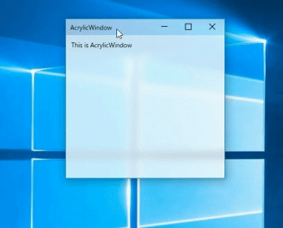
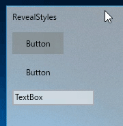
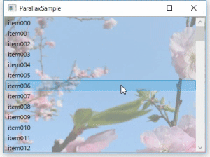
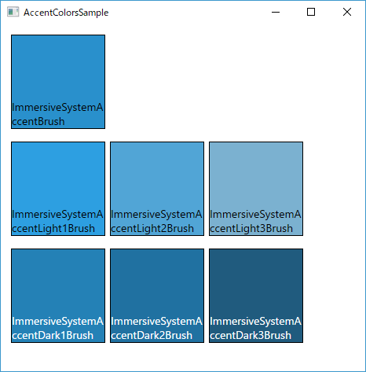

# FluentWPF

FluentWPF provides Fluent Design System for WPF.

## Overview

* Acrylic
  * AcrylicWindow
  * AcrylicBrush
* Reveal
  * Reveal styles for controls(Button/TextBox/ListBox)
* ParallaxView
* AccentColors



## Install

*NuGet Package*
```
Install-Package FluentWPF
```
https://nuget.org/packages/FluentWPF

### Preparation

Add XAML namespace.

```xml
xmlns:fw="clr-namespace:SourceChord.FluentWPF;assembly=FluentWPF"
```

Add ResourceDictionary to App.xaml.

```xml
<Application.Resources>
    <ResourceDictionary>
        <ResourceDictionary.MergedDictionaries>
             <!--  FluentWPF Controls  -->
            <ResourceDictionary Source="pack://application:,,,/FluentWPF;component/Styles/Controls.xaml" />
        </ResourceDictionary.MergedDictionaries>
    </ResourceDictionary>
</Application.Resources>
```

## Usage

### Acrylic

#### AcrylicWindow



```xml
<fw:AcrylicWindow x:Class="WpfApp1.MainWindow"
        xmlns="http://schemas.microsoft.com/winfx/2006/xaml/presentation"
        xmlns:x="http://schemas.microsoft.com/winfx/2006/xaml"
        xmlns:d="http://schemas.microsoft.com/expression/blend/2008"
        xmlns:mc="http://schemas.openxmlformats.org/markup-compatibility/2006"
        xmlns:local="clr-namespace:WpfApp1"
        xmlns:fw="clr-namespace:SourceChord.FluentWPF;assembly=FluentWPF"
        mc:Ignorable="d"
        Title="MainWindow" Height="300" Width="300">
    <Grid Background="#70FFFFFF">
        <TextBlock Margin="10"
                   HorizontalAlignment="Left"
                   VerticalAlignment="Top"
                   Text="This is AcrylicWindow"
                   TextWrapping="Wrap" />
    </Grid>
</fw:AcrylicWindow>
```

**Code Behind**
Remove base class definition.
```cs
public partial class MainWindow
{
    public MainWindow()
    {
        InitializeComponent();
    }
}
```

##### Properties

|Property Name|Type|Description|
|-----|-----|-----|
|TintColor|Color|Gets or sets the color tint for the semi-transparent acrylic material.|
|TintOpacity|double|Gets or sets the degree of opacity of the color tint.|
|NoiseOpacity|double|Gets or sets the degree of opacity of the noise layer.|
|FallbackColor|Color|Gets or sets the color when window is inactive.|
|ShowTitleBar|bool|Gets or sets a value that indicates whether TitleBar is visible.|

##### Using as Attached Property

AcrylicWindow can also be used as an Attached Property.

```xml
<Window x:Class="WpfApp1.MainWindow"
        xmlns="http://schemas.microsoft.com/winfx/2006/xaml/presentation"
        xmlns:x="http://schemas.microsoft.com/winfx/2006/xaml"
        xmlns:d="http://schemas.microsoft.com/expression/blend/2008"
        xmlns:mc="http://schemas.openxmlformats.org/markup-compatibility/2006"
        xmlns:local="clr-namespace:WpfApp1"
        xmlns:fw="clr-namespace:SourceChord.FluentWPF;assembly=FluentWPF"
        mc:Ignorable="d"
        Title="AcrylicWindow2" Height="300" Width="300"
        fw:AcrylicWindow.Enabled="True">
    <Grid>
        
    </Grid>
</Window>
```

**Code Behind**
```cs
public partial class MainWindow : Window
{
    public MainWindow()
    {
        InitializeComponent();
    }
}
```

#### AcrylicBrush


```xml
<Window x:Class="FluentWPFSample.Views.AcrylicBrushSample"
        xmlns="http://schemas.microsoft.com/winfx/2006/xaml/presentation"
        xmlns:x="http://schemas.microsoft.com/winfx/2006/xaml"
        xmlns:d="http://schemas.microsoft.com/expression/blend/2008"
        xmlns:fw="clr-namespace:SourceChord.FluentWPF;assembly=FluentWPF"
        xmlns:local="clr-namespace:FluentWPFSample.Views"
        xmlns:mc="http://schemas.openxmlformats.org/markup-compatibility/2006"
        Title="AcrylicBrushSample"
        Width="640"
        Height="480"
        mc:Ignorable="d">
    <Window.Resources>
        <BooleanToVisibilityConverter x:Key="booleanToVisibilityConverter" />
    </Window.Resources>
    <Grid>
        <Grid.RowDefinitions>
            <RowDefinition />
            <RowDefinition Height="Auto" />
        </Grid.RowDefinitions>
        <Grid x:Name="grid" Background="White">
            <Grid.ColumnDefinitions>
                <ColumnDefinition Width="Auto" />
                <ColumnDefinition />
            </Grid.ColumnDefinitions>
            <StackPanel>
                <Button Width="75" Margin="5" Content="Button" />
                <Button Width="75" Margin="5" Content="Button" />
                <Button Width="75" Margin="5" Content="Button" />
            </StackPanel>
            <Image Grid.Column="1"
                   Margin="5"
                   Source="/FluentWPFSample;component/Assets/Images/1.jpg" />
        </Grid>

        <Rectangle Grid.ColumnSpan="2"
                   Margin="40"
                   Fill="{fw:AcrylicBrush grid}"
                   Stroke="Black"
                   Visibility="{Binding IsChecked, ElementName=chkShowAcrylicLayer, Converter={StaticResource booleanToVisibilityConverter}}" />
        <CheckBox x:Name="chkShowAcrylicLayer"
                  Grid.Row="1"
                  Margin="5"
                  HorizontalAlignment="Left"
                  Content="Show Acrylic Rect"
                  IsChecked="True" />
    </Grid>
</Window>
```

### Reveal

Reveal effect for controls.

To use the reveal effect, set `fw:PointerTracker.Enabled="True"` on a parent container.


```xml
<Grid fw:PointerTracker.Enabled="True" Background="#01FFFFFF" Margin="3">
    <StackPanel>
        <Button Content="Button" HorizontalAlignment="Left" Margin="5" Width="75" Height="32"
                Style="{StaticResource ButtonRevealStyle}"/>

        <Button Content="Button" HorizontalAlignment="Left" Margin="5" Width="75" Height="32"
                Background="Transparent"
                Style="{StaticResource ButtonRevealStyle}"/>

        <TextBox HorizontalAlignment="Left" Height="23" Margin="5" Text="TextBox" Width="120"
             Style="{StaticResource TextBoxRevealStyle}"/>
    </StackPanel>
</Grid>
```

### ParallaxView



```xml
<Grid>
    <fw:ParallaxView VerticalShift="200" HorizontalShift="200"
                     Source="{Binding ElementName=list}">
        <Image Source="/FluentWPFSample;component/Assets/Images/1.jpg" Stretch="UniformToFill"/>
    </fw:ParallaxView>
    <ListBox x:Name="list" Background="#88EEEEEE" ScrollViewer.CanContentScroll="False"
             ItemsSource="{Binding Items}"/>
</Grid>
```

#### Properties

|Property Name|Type|Description|
|-----|-----|-----|

### AccentColors



```xml
<StackPanel Margin="5">
    <StackPanel.Resources>
        <Style TargetType="Border">
            <Setter Property="Width" Value="120" />
            <Setter Property="Height" Value="120" />
            <Setter Property="Margin" Value="3" />
            <Setter Property="BorderBrush" Value="Black" />
            <Setter Property="BorderThickness" Value="1" />
        </Style>
        <Style TargetType="TextBlock">
            <Setter Property="TextWrapping" Value="Wrap" />
            <Setter Property="VerticalAlignment" Value="Bottom" />
            <Setter Property="FontSize" Value="14" />
        </Style>
    </StackPanel.Resources>
    <StackPanel Orientation="Horizontal" Margin="5">
        <Border Background="{x:Static fw:AccentColors.ImmersiveSystemAccentBrush}">
            <TextBlock Text="ImmersiveSystemAccentBrush" />
        </Border>
    </StackPanel>
    <StackPanel Orientation="Horizontal" Margin="5">
        <Border Background="{x:Static fw:AccentColors.ImmersiveSystemAccentLight1Brush}">
            <TextBlock Text="ImmersiveSystemAccentLight1Brush"/>
        </Border>
        <Border Background="{x:Static fw:AccentColors.ImmersiveSystemAccentLight2Brush}">
            <TextBlock Text="ImmersiveSystemAccentLight2Brush"/>
        </Border>
        <Border Background="{x:Static fw:AccentColors.ImmersiveSystemAccentLight3Brush}">
            <TextBlock Text="ImmersiveSystemAccentLight3Brush" />
        </Border>
    </StackPanel>
    <StackPanel Orientation="Horizontal" Margin="5">
        <Border Background="{x:Static fw:AccentColors.ImmersiveSystemAccentDark1Brush}">
            <TextBlock Text="ImmersiveSystemAccentDark1Brush" Foreground="White"/>
        </Border>
        <Border Background="{x:Static fw:AccentColors.ImmersiveSystemAccentDark2Brush}">
            <TextBlock Text="ImmersiveSystemAccentDark2Brush" Foreground="White"/>
        </Border>
        <Border Background="{x:Static fw:AccentColors.ImmersiveSystemAccentDark3Brush}">
            <TextBlock Text="ImmersiveSystemAccentDark3Brush" Foreground="White"/>
        </Border>
    </StackPanel>
</StackPanel>
```

#### Colors/Brushes

* Colors
  * ImmersiveSystemAccent
  * ImmersiveSystemAccentLight1
  * ImmersiveSystemAccentLight2
  * ImmersiveSystemAccentLight3
  * ImmersiveSystemAccentDark1
  * ImmersiveSystemAccentDark2
  * ImmersiveSystemAccentDark3
* Brushes
  * ImmersiveSystemAccentBrush
  * ImmersiveSystemAccentLight1Brush
  * ImmersiveSystemAccentLight2Brush
  * ImmersiveSystemAccentLight3Brush
  * ImmersiveSystemAccentDark1Brush
  * ImmersiveSystemAccentDark2Brush
  * ImmersiveSystemAccentDark3Brush

## License

[MIT License](LICENSE)
